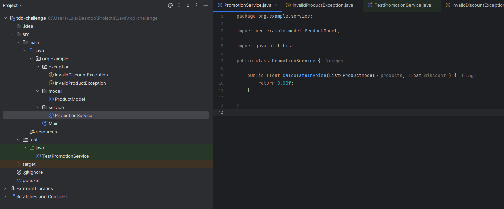
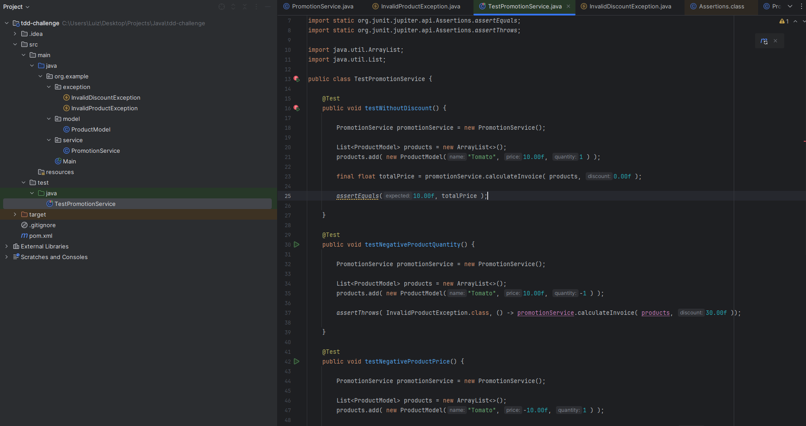
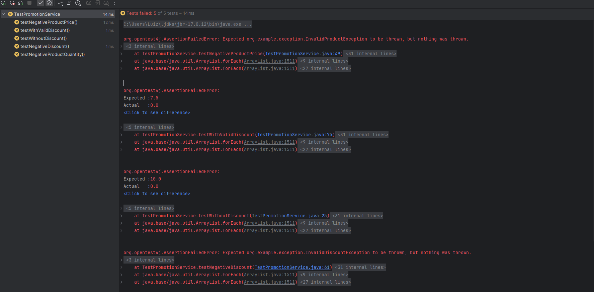
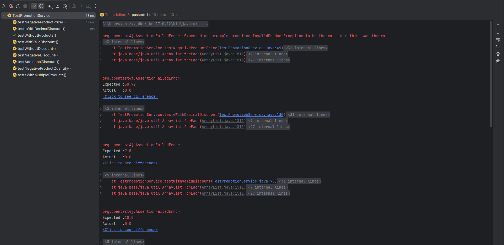
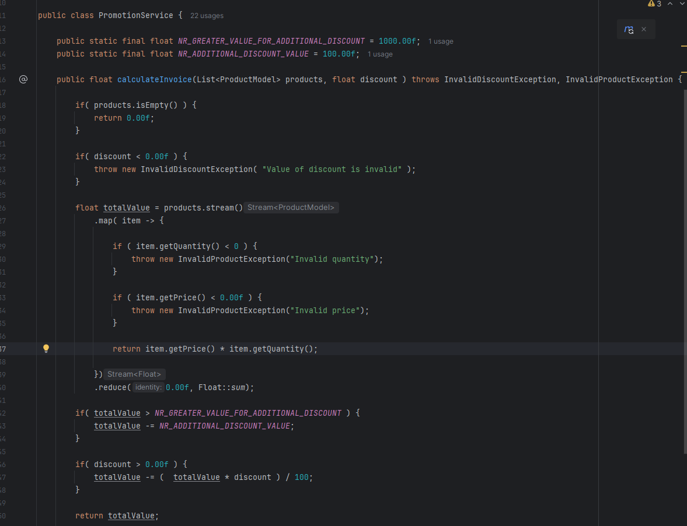
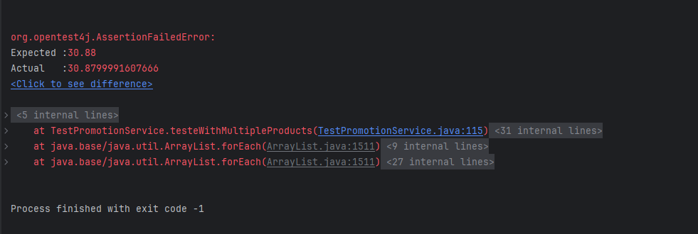
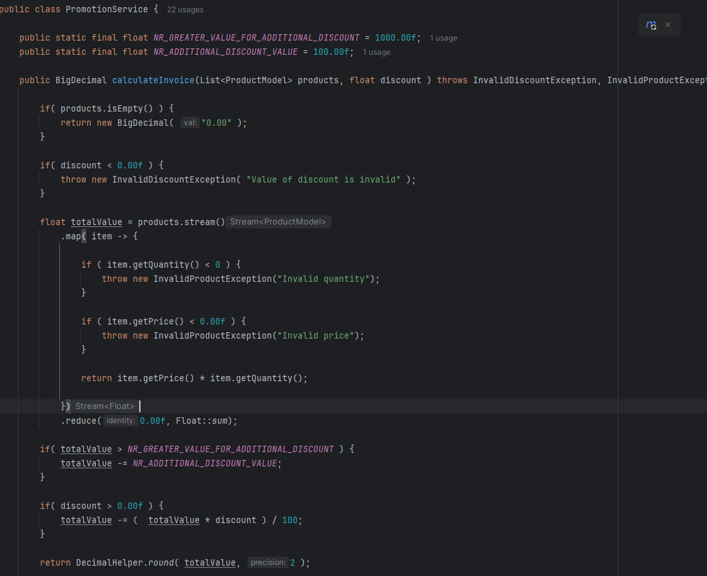
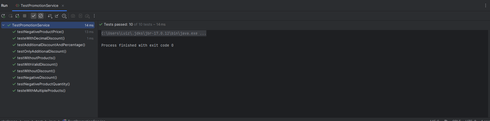

# Casos de teste

| Nome do Teste                      | Cenário                                  | Produtos (Nome, Preço, Quantidade)          | Desconto (%) | Resultado Esperado         |
|------------------------------------|------------------------------------------|---------------------------------------------|--------------|----------------------------|
| testWithoutDiscount                | Sem desconto aplicado                    | Tomato, 10.00, 1                            | 0.00         | 10.00                     |
| testNegativeProductQuantity        | Quantidade de produto negativa           | Tomato, 10.00, -1                           | 30.00        | `InvalidProductException` |
| testNegativeProductPrice           | Preço do produto negativo                | Tomato, -10.00, 1                           | 30.00        | `InvalidProductException` |
| testNegativeDiscount               | Desconto negativo aplicado               | Tomato, 10.00, 1                            | -30.00       | `InvalidDiscountException`|
| testWithValidDiscount              | Desconto válido aplicado                 | Tomato, 10.00, 1                            | 25.00        | 7.50                      |
| testWithoutProducts                | Sem produtos na lista                    | (Nenhum)                                    | 25.00        | 0.00                      |
| testOnlyAdditionalDiscount         | Apenas desconto adicional aplicado       | Tomato, 1250.00, 1                          | 0.00         | 1150.00                   |
| testAdditionalDiscountAndPercentage| Desconto percentual e adicional juntos   | Tomato, 1250.00, 1                          | 10.00        | 1035.00                   |
| testeWithMultipleProducts          | Múltiplos produtos com desconto aplicado | Tomato 5.00, 1; Orange 10.00, 2; Banana 2.50, 3 | 5.00         | 30.88                     |
| testeWithDecimalDiscount           | Desconto decimal aplicado                | Tomato 5.00, 1; Orange 10.00, 2; Banana 2.50, 3 | 5.27         | 30.79                     |

## Passo a passo

> ### Primeira parte

  - #### Estrutura inicial
  

  - #### Primeiros testes
  

  - #### Resultado da execução 
  

  - #### Resultado de mais testes
  

> ### Criacao da Função

  - #### Função de calculo do desconto
  

  - #### Passou a maioria dos testes, mas ocorreu um erro de arredondamento
  

  - #### Função com o round, considerando duas casas decimais
  

> ### Resultado final

  - #### Testes passando
  
